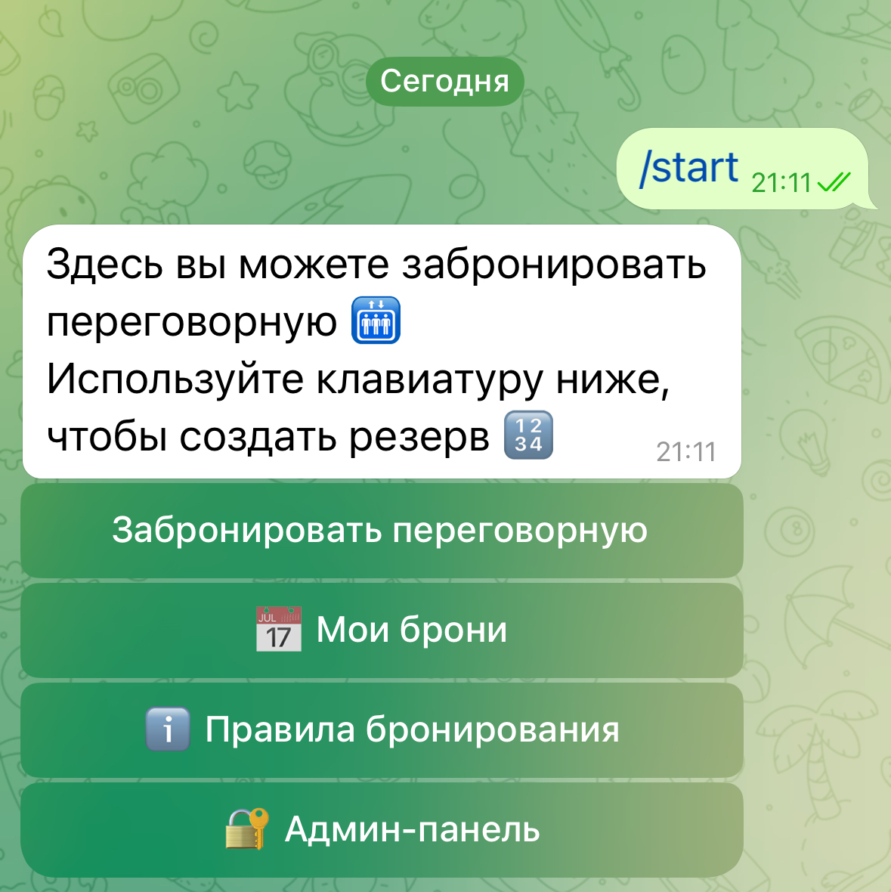
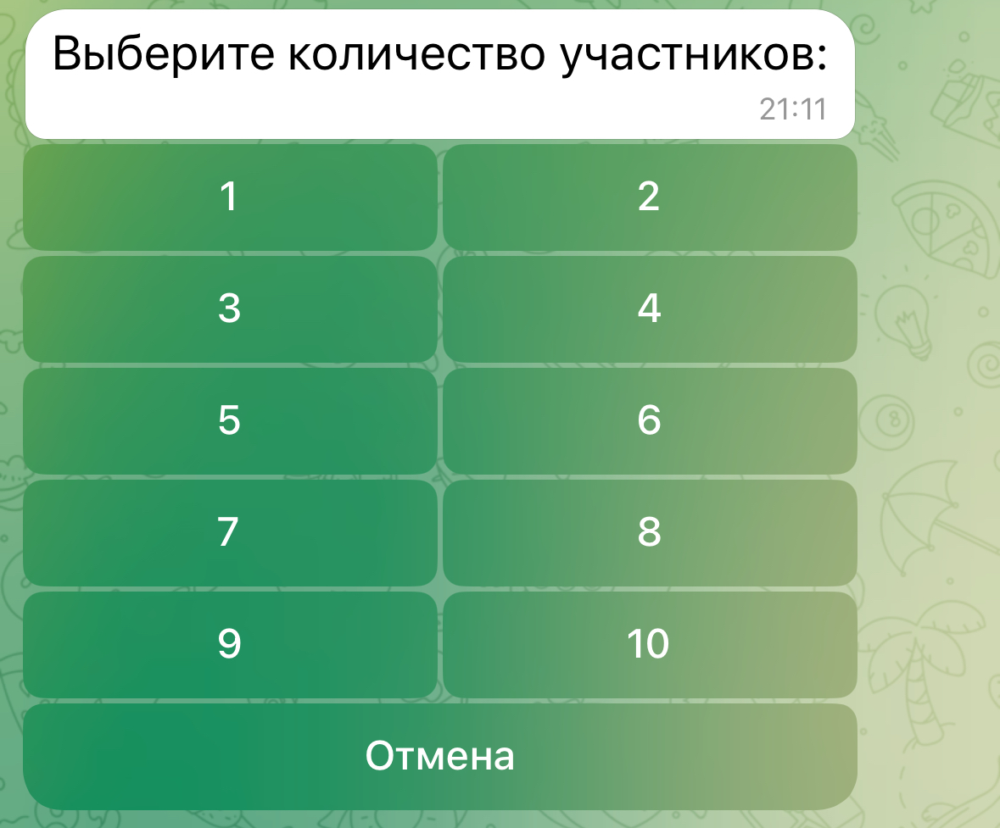
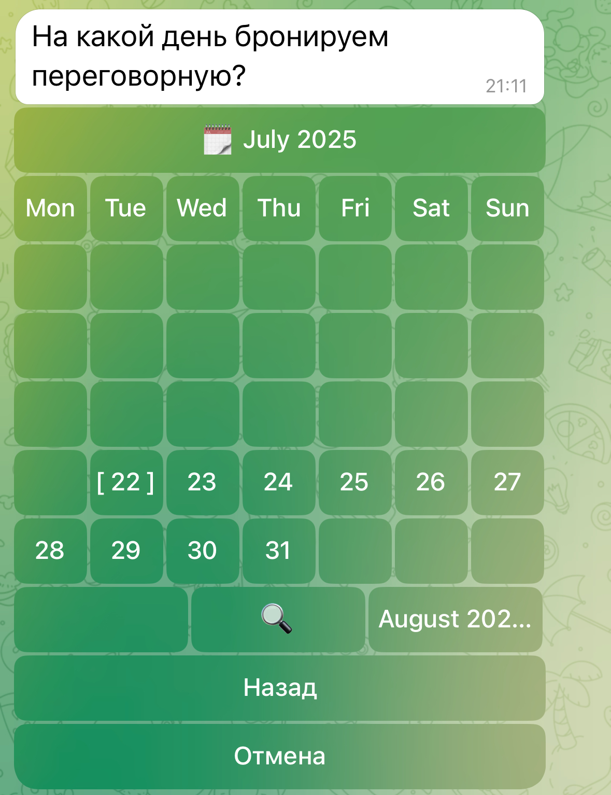
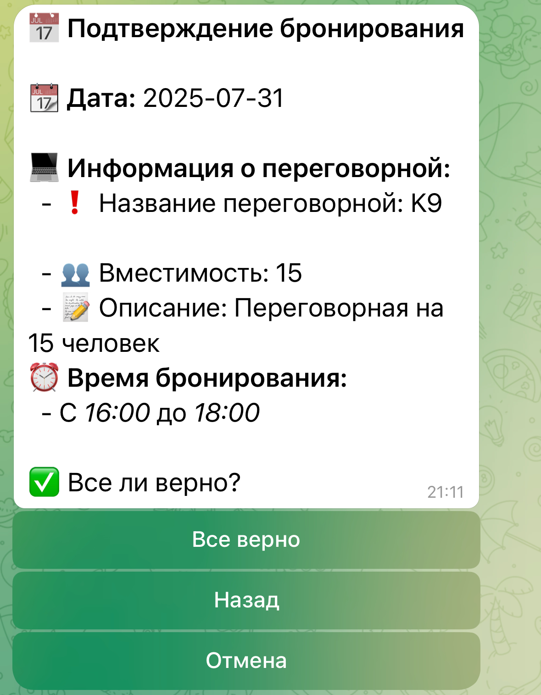
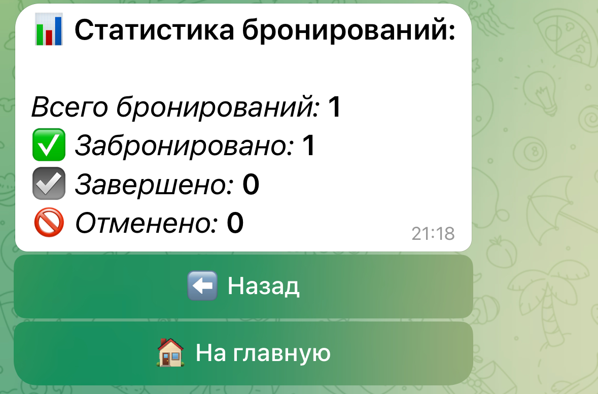

# Meeting rooms booking (Телеграм-бот для бронирования переговорных на вебхуках)

## Стек технологий

## Возможности бота:

<ul>
  <li>
    Выбор количества участников
  </li>
  <li>
    Выбор конкретной переговорной
  </li>
  <li>
    Выбор даты, на когда бронь
  </li>
  <li>
    Выбор времени, на когда бронь
  </li>
  <li>
  Подтверждение
  </li>
</ul>

##### Примеры:

  
  

  
  
  

